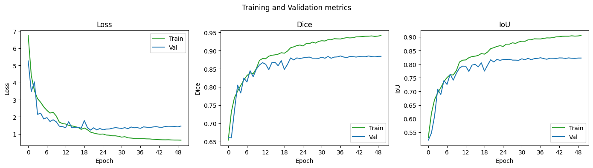
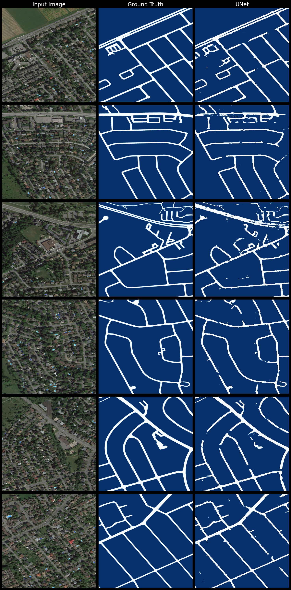

# UNet road image segmentation with PyTorch

PyTorch UNet implementation for road segmentation in satellite images using the [RoadNet dataset](https://github.com/yhlleo/RoadNet).

## Training 

The RoadNet dataset consists of TIFF satellite images with their corresponding segmentation mask. Each image is split into 256x256 square tiles which are fed into the network. 

A UNet model was trained for 50 epochs with BCE loss function and Adam optimizer with an initial learning rate of 3e-4 and exponential decay of learning rate every 10 epochs. Intersection over union and Dice coefficient evaluation metrics are also computed during training and validation.

## Results

Training and validation metrics during training are shown in the following figure. The best iteration obtained IoU = 0.82 and Dice = 0.88 on validation.

The next figure shows a visual comparison of segmentation predictions against ground truth for the validation set, where it can be seen that the model accurately segmented roads, although its performance dropped in parking lots and where trees block the satellite image.

